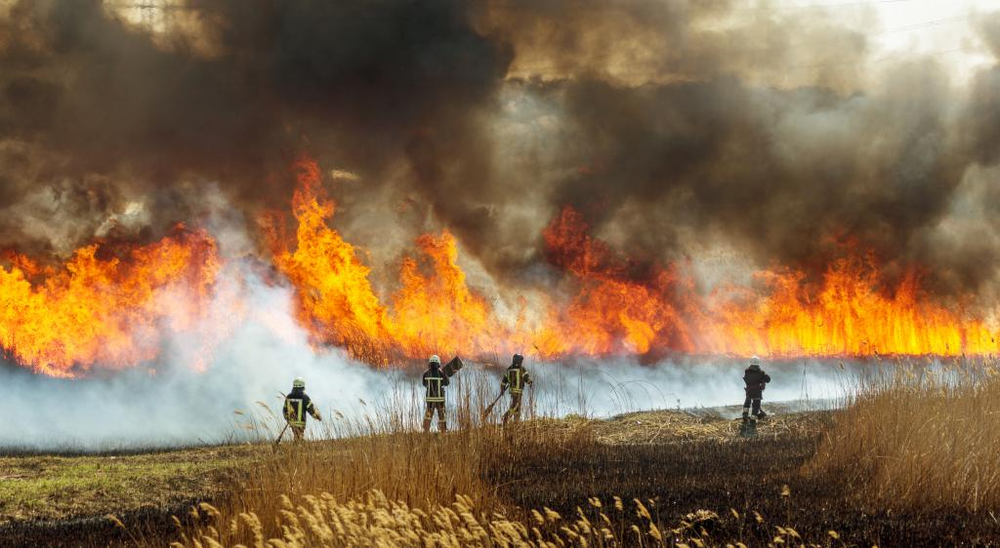

# Forest Fire prediction
Fire Departments experts can tell where and when there is a higher chance for a forest fire to take place. 
These experts can use up to 2-4 parameters to make their estimations, a Machine Learning model obviously can leverage many other parameters 
and provide a probability score for a forest fire.

 

